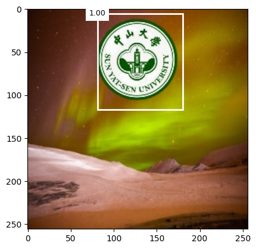
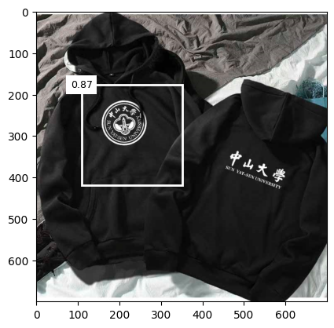

# TinySSD-Pytorch
AI Experiment Personal Homework

## 🔧 依赖以及安装

- NVIDIA-SMI Version >= 517.8
- CUDA Version >= 11.7
- Python >= 3.8 (推荐使用[Anaconda](https://www.anaconda.com/download/#linux)或[Miniconda](https://docs.conda.io/en/latest/miniconda.html))
- [PyTorch >= 1.12.1](https://pytorch.org/)

#### 安装

1. 把项目克隆到本地

    ```bash
    git clone https://github.com/OliverGrace/TinySSD-Pytorch.git
    cd TinySSD-Pytorch
    ```

2. 安装依赖([Anaconda](https://www.anaconda.com/download/#linux)或pip)
    
    方式1：
    Anaconda 配置
    ```bash
    conda create --name tinyssd_pytorch --file requirements_conda.txt
    ```
    
    方式2：
    pip 配置
    ```bash
    pip install -r requirements_pip.txt
    ```
3.  从[Release](https://github.com/OliverGrace/TinySSD-Pytorch/releases/tag/main)下载背景图片数据集并将数据解压放至data文件夹中，最终目录如下

    ```
    ├─data
      │  create_train.py
      │  
      ├─background
      │      000012-16347456122a06.jpg
      │	    ...
      │      191313-1519470793f344.jpg
      │      191328-15136820086f91.jpg
      │          
      ├─target
      │      0.jpg
      │      0.png
      │      1.png
      │      2.png
      │      
      └─test
             1.jpg
             2.jpg
    ```
    
4.  运行create_train.py生成训练集

    ```
    cd data
    python3 create_train.py
    ```
    运行完成后目录结构如下
    ```
    ├─data
      │  create_train.py
      │  
      ├─background
      │      000012-16347456122a06.jpg
      │	    ...
      │      191313-1519470793f344.jpg
      │      191328-15136820086f91.jpg
      │      
      ├─sysu_train
      │  │  label.csv
      │  │  
      │  └─images
      │          000012-16347456122a06.jpg
      │		...
      │          183201-15420187218258.jpg
      │          
      ├─target
      │      0.jpg
      │      0.png
      │      1.png
      │      2.png
      │      
      └─test
             1.jpg
             2.jpg
    ```
## 💪 训练以及测试

#### 训练
   - 在train.py中修改batch_size以及epoch之后运行即可
    `
    python train.py
    `              
#### 测试
   - 在test.py中修改测试文件路径以及weight路径后运行即可得到测试结果
    `
    python test.py
    `
#### 测试结果
    
    
## 😀 如何在自己的数据上训练

   - background文件夹中包含了背景图片，target文件夹中包含了加入到背景图中的目标图片(即需要检测的目标)。此处可以自行替换为所需检测的目标图片，命名为`0.png`替换后重新调用`create_train.py`即可生成自己的训练集
